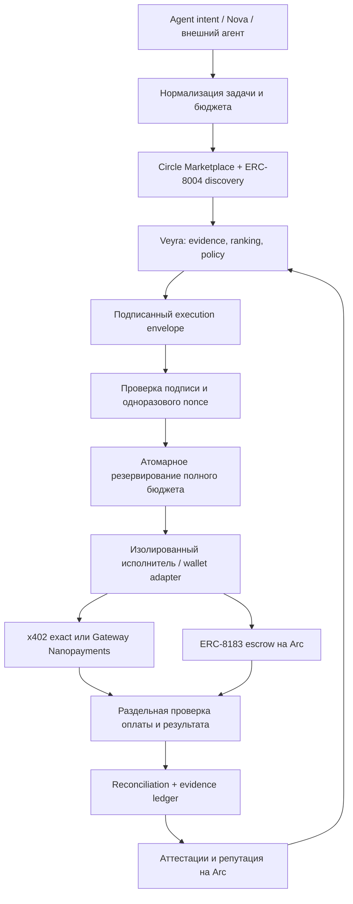

# Veyra — аудит архитектуры и готовности к Arc mainnet

Дата: 15 сентября 2026. Исходная ревизия: `5a34d11`, рабочая копия пользователя.

## Вывод

**Veyra хорошо соответствует направлению Arc: USDC, открытая идентичность агентов, проверяемая история, программируемые расчёты и отдельная оценка контрагентов. Однако текущая реализация ещё не готова к автономному расходованию реальных средств.**

Главная работа перед mainnet — сделать решение Veyra обязательным для каждого исполнительного пути и исправить авторизацию, раскрытие подписей и учёт неопределённых платежей. Замена RPC и адресов недостаточна.

По проверенным официальным источникам Arc остаётся testnet; mainnet-адреса ещё не опубликованы. Это оценка готовности к будущему переходу, а не предложение переключить приложение сейчас. [Arc contract addresses](https://docs.arc.io/arc/references/contract-addresses), [Connect to Arc](https://docs.arc.io/arc/references/connect-to-arc).

При этом **x402-покупки в браузере уже могут использовать mainnet других сетей**: Base, Ethereum и другие сети присутствуют в `lib/x402/usdc-assets.ts`, выбор accept не ограничен testnet. Arc Testnet в заголовке продукта не означает, что все доступные платежи используют тестовые деньги.

## Объём и способ проверки

- Прочитаны установленные `use-arc`, `use-agent-wallet`, `use-developer-controlled-wallets`, `use-gateway`, соответствующие Gateway references, все пять файлов `docs/ai-context`, README и архитектурные документы.
- Использован Arc Docs MCP: поиск и чтение агентной архитектуры, сети, контрактов и отличий EVM.
- Использован Circle MCP по JSON-RPC на `https://api.circle.com/v1/codegen/mcp`: `tools/list`, `search_circle_documentation`, `get_circle_product_summary` для Gateway и Developer-Controlled Wallets. MCP не был экспортирован отдельным инструментом сессии, поэтому вызван непосредственно через HTTP. Дополнительно прочитаны актуальные официальные страницы Agent Stack, Nanopayments и ERC.
- Изучены основные пути discovery → decision → clearance → execution → settlement, API авторизации, SQL резервирования, Nova и три собственных контракта.
- Выполнены локальные тесты, безопасные воспроизведения с временными ключами, read-only запросы Arc RPC и публичного Circle Discovery API.
- Средства не переводились, платные API не вызывались, пользовательские подписи не создавались, production DB и настройки развёрнутого приложения не изменялись. Код приложения не менялся.

Это аудит исходников и выбранных интеграционных границ. Он не заменяет внешний аудит контрактов и не подтверждает применённость всех SQL-миграций, конфигурацию секретов или точное соответствие production runtime этой рабочей копии.

## 1. Рекомендуемая архитектура

### Роли компонентов

| Компонент | Что ему поручить |
| --- | --- |
| Circle Agent Stack | Wallet interface, discovery платных сервисов, выполнение платежей и ограничения кошелька |
| Veyra | Выбор контрагента, качество и свежесть доказательств, риск, бюджет, объяснимое разрешение конкретного действия |
| x402 exact | Оплата отдельного API-вызова по объявленным условиям |
| Gateway Nanopayments | Частые мелкие платежи из внесённого Gateway balance с пакетным расчётом |
| ERC-8004 | Открытая идентичность и сигналы репутации; не сертификат добросовестности |
| ERC-8183 | Задача, USDC escrow, результат, evaluator, выплата либо возврат |
| Arc | Сеть идентичности, контрактов задач и публичных аттестаций Veyra; отдельный платёж может происходить в другой сети |

Circle Agent Wallets уже предоставляют spending policies, recipient allowlists и contract blocklists. Ценность Veyra должна быть в решении на основании доказательств: **почему доверять этому поставщику для этой задачи и этой суммы**, а также в проверке результата. Одни суточные лимиты не являются достаточным отличием. [Agent wallets](https://developers.circle.com/agent-stack/agent-wallets).

### Выбор кошелька

1. **Личный агент пользователя:** Circle Agent Wallet как возможный wallet adapter; текущая подпись в браузерном кошельке остаётся нормальным вариантом ручного режима. Agent Wallet построен на user-controlled wallet/MPC и не тождествен developer-controlled wallet.
2. **Собственные treasury, relayer, выплаты сервиса:** Developer-Controlled Wallets подходят при осознанной серверной модели управления активами. Нельзя считать их интеграцию обязательной для независимого trust API.
3. **Автономное исполнение:** агент не должен иметь альтернативный прямой путь к широким wallet credentials. Проверка Veyra должна быть обязательна на стороне signer/executor; wallet policy служит вторым ограничителем. Произвольный clearance Veyra сам по себе не становится правилом Circle Wallet автоматически — это интеграцию необходимо реализовать и проверить.
4. **Gateway для SCA:** для crosschain burn intents требуется проверенная схема EOA delegate; не переносить этот механизм автоматически на Nanopayments. Поддержка smart-account/EIP-1271 подписей проверяется для каждого rail отдельно.

В проекте есть настоящая интеграция `@circle-fin/x402-batching` и App Kit. Наличие Circle skills и discovery ещё не означает, что серверный исполнитель использует Circle Agent Wallet или Developer-Controlled Wallets: сейчас ключевые серверные adapters подписывают локальными env-ключами через viem.

### Что именно подписывать

Execution envelope должен связывать: tenant/owner, subject wallet, identity registry + agent ID, разрешённого исполнителя, rail, settlement chain ID, asset, recipient, нормализованный URL, HTTP method, hash request body или calldata, quote hash, точную сумму, потолок комиссий, версию policy, hash evidence snapshot, deadline, nonce и mandate ID.

Текущий `TrustClearance` связывает ряд важных полей и защищён EIP-712, но не имеет отдельных полей settlement network, asset, HTTP method/request body. Часть контекста кодируется через `actionHash` и идентификатор selection; исполнители должны заново связать этот контекст с реальным запросом. Подпись EIP-3009 сама по себе фиксирует перевод, а не смысл HTTP-задачи.

### Два времени завершения

Для Nanopayments следует различать получение ответа, принятие авторизации Gateway, блокирование средств и финальный onchain batch. В обычном x402 отдельно проверять receipt фактической сети. Для ERC-8183 — состояние escrow и результат evaluator. Ни HTTP 200, ни произвольный `transaction` в ответе продавца не доказывают все эти события. [Batched settlement](https://developers.circle.com/gateway/nanopayments/concepts/batched-settlement).

## 2. Что уже сделано хорошо

- Концепция двух платёжных путей с общей trust policy соответствует официальной агентной архитектуре Arc. [Agentic economy](https://docs.arc.io/build/agentic-economy).
- Есть ERC-8004 identity/reputation/validation, доказательства происхождения экономических событий, ограничение доверия при недостатке истории и проверка изменения владельца.
- TrustGate использует EIP-712, роли attester/executor, expiry и одноразовое потребление clearance.
- Evaluator имеет роли, pause, replay protection и защиту от reentrancy. Подпись evaluator и расчёт escrow отделены от LLM.
- В основной схеме базы резервирование бюджета использует блокировку строки mandate и суммирует lifetime usage. Это правильный фундамент.
- Браузерный ERC-8183 approve ограничен суммой бюджета; основной браузерный x402 путь использует SSRF-защищённый fetch.
- Nova PREVIEW не выдаёт разрешение на реальную автономную оплату. Важно сохранить это свойство до закрытия проблем ниже.
- В коде учтены USDC native 18 decimals, ERC-20 6 decimals, системный emitter и blocklist. Эти сведения соответствуют Arc; ERC-20 и native представляют один баланс. [USDC events](https://docs.arc.io/arc/references/usdc-system-events).
- Исходники честно поясняют, что Arc фиксирует аттестацию Veyra, а не самостоятельно проверяет её истинность.

Read-only Arc RPC вернул chain ID `5042002`; bytecode присутствует у Proof Registry, TrustGate, Evaluator и reference AgenticCommerce из `docs/contracts.md`. Задача `186207` существует: budget `50000` atomic USDC = `0.05 USDC`, status `3` = Completed, evaluator совпадает с опубликованным. Это подтверждает работающий сценарий, но не все гарантии продукта.

## 3. Подтверждённые проблемы и приоритеты

P1 — исправить до автономных платежей реальными средствами. P2 — существенная интеграционная или эксплуатационная доработка. Где проверка ограничена исходниками, это указано отдельно.

### F1 · P1 · Legacy authentication позволяет повторить подпись для другого действия

**Место:** `lib/execution/auth.ts:118–137`; nonce registry находится в памяти процесса.

После проверки структурированного сообщения код всегда пробует старое сообщение, подписывающее только wallet и timestamp. Nonce и API path туда не входят. Перехваченную действующую legacy-подпись можно повторить с новым `x-wallet-nonce` для другого пути в течение окна авторизации. Это не получение ключа и не подделка подписи: меняются неподписанные параметры.

**Воспроизведено локально:** одна временная подпись успешно аутентифицировала `/prepare` и `/autopilot` с разными nonce. Дополнительно process-local Map не обеспечивает одноразовость между serverless-инстансами.

**Исправление:** убрать runtime fallback; связывать method, path, body hash, nonce, timestamp и audience; атомарно потреблять nonce в общем хранилище после проверки подписи. Тестировать повтор между двумя процессами.

### F2 · P1 · Public execution API возвращает платёжные подписи

**Место:** `app/api/execution/v1/route.ts:11–24`, `app/api/execution/v1/[executionId]/route.ts:11–23`, `lib/execution/db.ts:410`, `lib/execution/browser-x402-ledger.ts:66–79`.

GET endpoints возвращают внутреннюю модель без owner authentication и public DTO. В `x402Context` записывается `authorizationSignature`; модель также содержит nonce, payer, срок и сумму. Локальная проверка save → list подтвердила сохранение полного поля подписи. Route отдаёт эту модель напрямую; фактическое наличие незавершённых подписей в production не исследовалось.

Подпись не позволяет поменять получателя и сумму. Однако действующую авторизацию можно попытаться подать раньше предусмотренного покупателем момента, нарушить порядок оплаты/получения результата или раскрыть коммерческие данные. Для Gateway срок авторизации существенно длиннее обычного HTTP-запроса.

**Исправление:** отдельный публичный receipt DTO без signatures/idempotency material/private URLs; приватный owner-scoped endpoint; шифрование краткоживущих authorizations в служебном хранилище; ограниченный срок хранения. Не требуется убирать публичную историю доказательств.

### F3 · P1 · Потерянный ответ ошибочно считается отсутствием платежа

**Место:** `lib/execution/browser-x402-ledger.ts:166–179`, `lib/execution/adapters/x402.ts:366–375`, `lib/execution/executor.ts:339–357`.

В браузерном пути `relayFailed` сразу даёт terminal `FAILED`. В серверном adapter общий catch возвращает `economicCommitted: false`, даже если исключение произошло после отправки подписи. Executor освобождает резерв. Продавец мог уже принять или списать платёж до разрыва соединения.

**Воспроизведено локально:** timeout после отправки подписи классифицируется как `FAILED`. Из кода следует, что reconciliation возвращает FAILED как уже terminal и не пытается разрешить неопределённость.

**Исправление:** фиксировать этап выдачи/отправки авторизации до внешнего вызова; после него использовать `SETTLEMENT_UNVERIFIED`, сохранять reservation и устойчивую reconciliation job. Новый nonce при повторе — только после установления судьбы предыдущего разрешения. Один HTTP 402 от потенциально недобросовестного endpoint тоже недостаточен для категоричного «ничего не переведено».

### F4 · P1 · Браузерный relay не требует решения Veyra

**Место:** `app/api/run/v1/quote/route.ts:35`, `app/api/run/v1/settle/route.ts:46`, `lib/x402/execution.ts:333–383`, `lib/execution/browser-x402-ledger.ts:102–108`.

Аутентификация пользователя/машинного клиента есть. Но settlement принимает `selectionId`, `selectionHash`, `clearanceDigest`, `verificationRequired` от клиента, допускает их отсутствие и не загружает обязательное серверное решение. Проверяются форма подписи, совпадение двух клиентских объектов и общий лимит 5 USDC. Сбой записи ledger намеренно не останавливает relay.

Это не даёт серверу права потратить неподписанные деньги: нужна подпись владельца. Но обещание «каждый платёж проходит policy Veyra» здесь не является принудительной гарантией. Через прямой запрос можно пропустить decision и обязательную проверку результата.

**Исправление:** persistent quote/execution record перед подписью; owner/payer binding; серверная проверка clearance и decision tier; повторная сверка network/asset/payee/method/body/price; DB reservation и idempotency обязательны перед отправкой. При отказе DB можно сохранить уже полученный результат, но нельзя начинать новый платёж без durable записи.

TrustGate сам по себе — verifier/consumer, а не кошелёк. `consumeClearance` не перемещает USDC и не проверяет последующую транзакцию. Серверный ERC-8183 adapter потребляет clearance отдельной транзакцией; браузерный createJob использует нулевой hook. Для сильного onchain enforcement нужен совместимый audited hook/router/smart-account module, где проверка и расход атомарны, либо изолированный обязательный signer для поддерживаемого wallet flow.

### F5 · P1 · Серверный x402 adapter обходит безопасный сетевой и wallet путь

**Место:** `lib/execution/adapters/x402.ts:51–54,90–95,260–268`; `app/api/execution/v1/[executionId]/execute/route.ts:26–31`.

Endpoint приходит из `taskPayload.endpointUrl`; запросы выполняет обычный `fetch`, без защиты `lib/seller/ssrf.ts`, с обычным поведением redirect. Реальный payer выбирается из `CANARY_DEPLOYER_PRIVATE_KEY` либо `VEYRA_TRUST_ATTESTER_PRIVATE_KEY`, а не из кошелька мандата. Для attempt без mandate execute route не проверяет owner relation, только общую аутентификацию.

**Воспроизведено локально с подменённым fetch:** adapter передаёт URL `http://127.0.0.1:9999/private` в транспорт. Сетевой запрос на этот адрес не совершался. В исходниках отсутствует привязка endpoint/body к утверждённому request hash на этой границе.

Риск зависит от доступности данного server execution path и конфигурации env-ключей; эти deployment условия не проверялись. Наличие хорошо защищённого браузерного relay старый adapter не защищает.

**Исправление:** убрать payer fallback на attester/deployer; обязательный wallet adapter с проверкой адреса payer и owner; закрепить endpoint/body в разрешении; использовать общий SSRF-safe transport; mandate-less execution либо owner-scoped, либо запрещён для серверных средств. Canary executor выделить явно и не включать в публичный runtime.

### F6 · P1 · Подтверждение продавца принимается за подтверждение расчёта

**Место:** `lib/x402/post-call-verification.ts:102–111`, `lib/execution/adapters/x402.ts:304–351`, `lib/execution/browser-x402-ledger.ts:181–197`.

Браузерная проверка берёт `settlement.success` из ответа проверяемого продавца. Серверный adapter объявляет `economicSettled: true`, обнаружив transaction в этом ответе, без проверки receipt в этой ветке. Итог влияет на COMPLETED, сумму расхода и последующее evidence/reputation.

Это наблюдение продавца, которое полезно сохранить, но нельзя превращать в независимое доказательство оплаты — особенно в продукте, оценивающем недобросовестных продавцов.

**Исправление:** уровни доказательств `seller_reported`, `facilitator_accepted`, `onchain_final`; отдельные поля payment status и service status; проверка nonce, payer, payee, asset, суммы и chain на каноническом источнике. Не повышать экономическую репутацию до выбранного уровня подтверждения. Arc attestation честно фиксирует источник заявления.

### F7 · P1 · Reconciliation не соответствует multichain/Nanopayments исполнению

**Место:** `lib/execution/settlement-resolver.ts:97–141`, `lib/execution/executor.ts:719–720`.

`RealArcSettlementResolver` всегда создаёт клиент Arc Testnet. Сохранённый `x402Context.network` не выбирает сеть RPC. Покупка на Base не будет подтверждена по Base receipt. Дополнительно resolver требует отдельный transaction hash и стандартный EIP-3009 calldata/event flow; Gateway batch не обязан предоставлять отдельную прямую транзакцию для каждой покупки.

**Исправление:** dispatch resolver по `(rail, settlementNetwork, facilitator)`; самостоятельная обработка Gateway acceptance/batch accounting; polling/webhook/retry по устойчивой очереди. Не менять global RPC на Base как обход: тогда сломается Arc.

### F8 · P1 · Отложенный расчёт бюджета привязан к неправильному дню

**Место:** `lib/execution/executor.ts:719,764–768`, `lib/execution/budget.ts:14–16`, `supabase/migrations/20260815120000_p61_trust_routed_execution.sql:229–250`.

Reconciliation вычисляет текущий день заново вместо дня исходной reservation. При переходе через полночь settle обновит другую usage row либо получит `USAGE_ROW_NOT_FOUND`; boolean результата не проверяется. При этом state уже переведён в COMPLETED отдельной DB-операцией. Сбой между state transition и budget settlement также оставляет несогласованный ledger. Это вывод по SQL и исходникам, без исполнения на production DB.

Отдельно Nova v2 подписывает timezone и attempts/day, а серверный budget helper остаётся UTC. До включения v2 AUTOPILOT нужно обеспечить одинаковые правила shadow и live.

**Исправление:** reservation ID и исходный budget period хранить в execution; одним идемпотентным SQL RPC переводить state и reservation в spend; retry/outbox для внешних действий; тесты midnight, DST, process crash и параллельного reconcile на настоящем PostgreSQL.

### F9 · P2 · Asset/domain allowlist частично доверяет challenge продавца

**Место:** `lib/x402/usdc-assets.ts:68–73`, `lib/x402/browser-payment.ts:145–161`.

Неизвестная chain ID принимается за USDC-сеть, если адрес токена совпал с адресом USDC любой известной сети. Для `GatewayWalletBatched` достаточно произвольного `extra.verifyingContract`, отличного от asset. Проверки адреса официального Gateway для этой сети нет.

**Воспроизведено:** неизвестная сеть `987654321` + адрес Base USDC проходят asset check; Gateway challenge с `0x1111…1111` принимается. Это не доказательство возможности произвольного списания с настоящего USDC: оно показывает отсутствие заявленной проверки идентичности сети/домена.

**Исправление:** только поддерживаемые `(chainId, asset, decimals, domainName, domainVersion, verifyingContract, scheme)`; неизвестная комбинация — отказ до подписи. Использовать SDK `CHAIN_CONFIGS`/официальные deployment manifests с контролируемым обновлением. [Nanopayments supported networks](https://developers.circle.com/gateway/nanopayments/supported-networks).

## 4. Переход на mainnet: обязательные изменения

### Конфигурация и версии

- Ввести единый manifest сети: chainId, RPC/fallback, explorer, USDC, Circle/Gateway environments, domain IDs, registry/commerce/evaluator/gate addresses, deployment block, expected bytecode hash, ABI version.
- Разделить `trustNetwork` и `settlementNetwork`. Mainnet-разрешение каждой settlement сети должно быть явным, а не следовать из найденного endpoint.
- При старте проверять `eth_chainId`, код нужных контрактов, роли attester, policy hash и соответствие окружений. Опубликованные mainnet параметры брать из официальных источников после запуска.
- `arcTestnet` уже есть в viem: убрать дублирование ручной chain definition и централизовать локальные overrides. Разница доменов `.network` и новых `.io` не является найденной поломкой: существующий RPC отвечает; migration должна опираться на доступность, а не замену строк вслепую.
- ERC-8004 и ERC-8183 сейчас Draft. Текущий Arc reference использует `fund(jobId, bytes)`, а актуальная спецификация ERC-8183 описывает `fund(jobId, expectedBudget, optParams)` для защиты согласованной суммы. Привязать adapter к конкретному deployment/ABI. Рабочий testnet контракт не следует ломать механической заменой ABI. [ERC-8004](https://eips.ethereum.org/EIPS/eip-8004), [ERC-8183](https://eips.ethereum.org/EIPS/eip-8183), [Arc reference tutorial](https://docs.arc.io/arc/tutorials/create-your-first-erc-8183-job).

### Ключи и права

- Развести wallet payer, trust attester, evaluator attester, relayer и admin. Запретить fallback между payer и attester.
- Для production attesters — отдельный signer/KMS/HSM либо подходящий wallet signing service; для администрирования — проверенный multisig и план смены ролей. Наличие env-ключа само по себе не доказывает утечку, но текущая общая серверная граница слишком широкая.
- Подготовить отзыв разрешений, ротацию, остановку выдачи новых clearance и независимый путь возврата escrow. Сбой evaluator не должен лишать клиента возврата после deadline.
- Проверить Circle webhook signatures и дедупликацию, если добавляется Developer-Controlled Wallets adapter; считать операцию завершённой по её terminal state, а не по принятию API-запроса.

### Деньги, evidence и Arc runtime

- Суммы платежей хранить atomic integer/decimal string; переходы через JS Number и `Math.round` убрать из критических границ. Native gas учитывать отдельно в 18 decimals, переводить единицы явно.
- Бюджет должен включать service price, плату Veyra, gas, Gateway/bridge fees и живые незавершённые authorizations. Gateway deposit — перемещение ликвидности, не повторный merchant spend.
- Для crosschain attestations добавить versioned evidence envelope с settlement chain, asset, rail, authorization/payment reference и степенью подтверждения. Текущий Proof Registry хранит сумму и hashes, но не явную settlement chain.
- Не переносить testnet reputation в mainnet как реальную экономическую историю. Сохранить provenance `testnet`, новый registry identity tuple и связь миграции, подтверждённую владельцем.
- Обычный Foundry не воспроизводит все Arc semantics. Добавить Arc Foundry/arc-anvil сценарии: USDC system events, отсутствие двойного учёта, gas floor 20 Gwei, blocklist/timeout, native/ERC-20 balance sharing. `cancun` compilation target сам по себе не ошибка; недостаточно только стандартного EVM тестирования. [EVM differences](https://docs.arc.io/arc/references/evm-differences).
- До реальных escrow средств — независимый аудит собственных контрактов и adapters, invariant/fuzz tests, recovery drill и ограниченный canary. Положительные unit tests не закрывают найденные end-to-end границы.

## 5. docs/ai-context и документация проекта

**Пять локальных snapshots актуальны на момент проверки:** оба `llms.txt` совпали с live после trim; agent card, skills index и OpenAPI совпали как JSON. Agent card/OpenAPI имеют version `2.0.0`, skills index — `1.0`. Это полезный контекст, а не источник требований Veyra: agent card принадлежит Circle Discovery API.

Добавить рядом manifest `sourceUrl`, `fetchedAt`, SHA-256 и назначение каждого файла. Сейчас каталог исключён из Git, поэтому fresh checkout не получает этот контекст автоматически. Нужен воспроизводимый read-only sync script, а не перенос всей внешней документации в приложение.

Установленные skills правильно направляют к testnet и различают wallet models, но не покрывают всю актуальную архитектуру Agent Stack, App Kit, Arc-specific EVM и batched settlement. Их следует периодически сверять с upstream. Формулировка Gateway «нет SDK» относится к прямой contract-level интеграции и не должна читаться как отсутствие App Kit/Nanopayments SDK вообще.

`docs/circle-agent-marketplace-readiness.md` требует обновления:

- Arc mainnet и обязательные Developer-Controlled Wallets для payout splitting перечислены как prerequisites listing, хотя официальная инструкция перечисляет payable endpoint, OpenAPI, payout wallet и review. Это возможные требования самого Veyra к выпуску, а не опубликованные обязательные условия Circle.
- Фактические public Trust API endpoints теперь `/api/x402/v1/*`; pricing в `lib/x402/trust-api/pricing.ts` расходится со старым примером документа.
- Актуальная инструкция Circle описывает ручной review заявки и постоянную проверку доступности endpoint. [Get listed](https://developers.circle.com/agent-stack/agent-marketplace/get-listed).

Read-only Discovery API на момент проверки: Arc Testnet — `total: 0`; Base — `total: 990`. Подсчёты `389`, `74`, `289` в README являются историческим снимком и должны иметь дату/источник либо быть убраны из постоянных обещаний. Эти totals не доказывают качество или доступность каждого сервиса.

## 6. Моё мнение о продукте

**Сохранить позиционирование Veyra как независимой оценки и контроля расходов. Nova — удобный клиент и демонстрация этого ядра.** Не требуется превращать Veyra в ещё один кошелёк или универсальный research marketplace.

Самые полезные следующие возможности:

1. **Узкий обязательный executor:** одна проверяемая граница между решением и подписью, которую используют Nova, браузер и внешний агент.
2. **Проверяемый receipt:** почему разрешено, что подписано, кто подтвердил оплату, что проверено в ответе, на какой сети всё произошло. Полный evidence можно экспортировать для внешнего verifier.
3. **Экономически разумная проверка:** не требовать отдельную Arc транзакцию и платный clearance на каждый миллионный доллара API-вызов. Короткоживущие scopes/сессии, per-call offchain verification и групповые anchors сохраняют контроль при малых суммах. Текущая цена clearance `0.01 USDC` может превышать сам вызов; её стоит тестировать как плату за решение/пакет, а не делать неизменным налогом на каждый nanopayment.
4. **Оценка качества результата:** hash подтверждает неизменность содержимого, schema — форму; ни один не доказывает истинность исследования. Показывать тип проверки и abstention, добавлять независимую повторную проверку для дорогих задач.
5. **Разделённая репутация:** живость endpoint, история исполнения, подтверждённая экономика, качество работы и независимость источников. Отдельно учитывать operator-funded canaries, self-dealing и коррелированные покупатели.

Отдельная интеграция Circle Agent Wallet полезна после укрепления executor. Использовать все продукты Circle одновременно ради соответствия экосистеме не нужно. Связка ERC-8004 + Veyra policy + x402/Gateway + ERC-8183 уже имеет ясный смысл.

## 7. Результаты проверок

| Проверка | Результат |
| --- | --- |
| TypeScript `tsc --noEmit --incremental false` | PASS |
| ESLint | 0 ошибок, 3 предупреждения навигации |
| Foundry | 31 PASS, 0 FAIL, 4 suites |
| 14 TypeScript test scripts | Все завершились с exit code 0 |
| Gitleaks + существующий pattern scan | Находок не сообщили |
| Read-only Arc RPC | chain ID, 4 deployment bytecodes, Completed job 186207 подтверждены |
| Локальные audit reproductions | Legacy replay, signature exposure в модели, timeout misclassification, unknown-chain/domain acceptance, raw-fetch private URL подтверждены |

TypeScript scripts: `erc8004-tests`, `erc8183-tests`, `reputation-tests`, `trust-gate-tests`, `counterparty-tests`, `marketplace-selection-tests`, `execution-unit-tests`, `execution-negative-tests`, `execution-product-tests`, `x402-browser-payment-tests`, `execution-ledger-tests`, `x402-post-call-verification-tests`, `nova-autonomy-tests`, `ssrf-protection-tests`.

Логи сохранены локально в `/tmp/veyra-audit/`. Тестовые авторизационные ключи создавались временно; их значения и подписи в логи не выводились. Unit/product tests частично используют in-memory/mocked adapters. Полный production build, production DB integration, browser E2E и mainnet canary в рамках этого аудита не выполнялись. Сканер секретов не является доказательством отсутствия секретов во всех возможных хранилищах.

## 8. Порядок работ

1. **Безопасная beta:** закрыть F1–F5; public DTO, обязательная policy, раздельные signers, ledger before dispatch. Оставить Nova в PREVIEW.
2. **Корректная экономика:** закрыть F6–F9; per-network reconciliation, atomic reservation settlement, строгий domain manifest, tests с потерей ответа и сменой дня.
3. **Migration-ready:** network manifest, версии ABI, mainnet/testnet isolation, migration identity/evidence, Arc runtime tests, внешний аудит и recovery drill.
4. **После официального Arc mainnet запуска:** проверить опубликованные параметры и поддержку каждого нужного Circle продукта; развернуть и проверить контракты, назначить роли, получить новые пользовательские mandates для нового домена, выполнить ограниченный canary и только затем расширять лимиты.

**Итог:** направление проекта менять не нужно. Следующий этап — обеспечить одинаковые, проверяемые гарантии на всех путях расхода. Именно это сделает Veyra самостоятельным trust-and-policy продуктом и подготовит его к mainnet.
