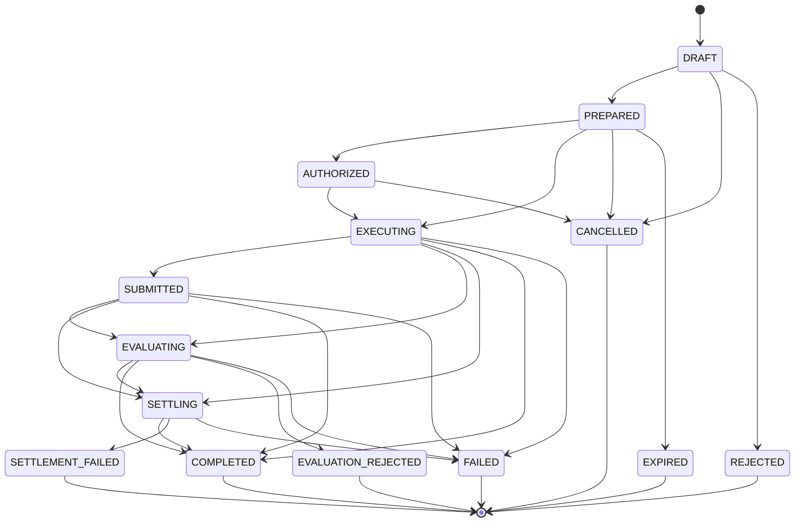

# Veyra Trust-Routed Execution (P6.1)

## Overview

**Veyra Trust-Routed Execution** allows an AI agent or user-authorized executor to safely execute transactions that have already passed Veyra discovery, counterparty ranking, trust policy evaluation, and signed clearance issuance.

### Canonical Promise

> *"Find the safest eligible counterparty for this task under my constraints, then execute only if the final transaction still matches the approved mandate."*

```
ERC-8004 Identity
  ↓
Reputation (Evidence-Weighted)
  ↓
Counterparty Selection
  ↓
Trust Gate Policy
  ↓
Signed EIP-712 Clearance
  ↓
Preflight Revalidation & Atomic Budget Reservation
  ↓
Execution Rails (ERC-8183 / x402)
  ↓
Settlement & Verification
  ↓
Evidence Ingestion & Arc Proof Anchor
```

---

## 1. Execution Modes

| Mode | Trigger | Behavior | Funds Movement |
| :--- | :--- | :--- | :--- |
| **A. PREVIEW** | User / Agent inspection | Runs candidate discovery, policy checks, clearance eligibility check. Does NOT issue execution tickets or lock funds. | No funds committed |
| **B. PREPARE** | Explicit approval request | Runs preflight, issues EIP-712 signed clearance ticket, prepares payload parameters. External executor submits payload. | Caller-driven settlement |
| **C. AUTOPILOT** | Autonomous Agent Execution | Runs full discovery → selection → preflight revalidation → atomic budget reservation → execution → evidence ingestion under an active EIP-712 Mandate. | Mandate-bounded settlement |

---

## 2. EIP-712 Execution Mandates

Execution Mandates allow owners to delegate bounded spending and task permissions to agents without exposing private keys.

### Domain & Structure

- **Name**: `Veyra Execution Mandate`
- **Chain ID**: `5042002` (Arc Testnet)
- **Primary Type**: `ExecutionMandate`

```typescript
export interface ExecutionMandate {
  mandateId: string;
  ownerWallet: `0x${string}`;
  subjectAgentId: string;
  subjectWallet: `0x${string}`;
  mode: "PREVIEW" | "PREPARE" | "AUTOPILOT";
  network: string; // "eip155:5042002"
  allowedCapabilities: string[];
  allowedRails: ("erc8183" | "x402")[];
  maxPerTransactionUsdc: number;
  maxPerDayUsdc: number;
  maxTotalUsdc: number;
  minimumTrustScore: number;
  minimumConfidence: number;
  requireVerifiedIdentity: boolean;
  evaluatorThresholdUsdc: number;
  canonicalHash: string;
  signature: `0x${string}`;
  nonce: number;
  version: string;
  issuedAt: string;
  expiresAt: string;
  revokedAt?: string | null;
}
```

---

## 3. Atomic Budget Reservation & Race-Condition Prevention

To prevent concurrent agent executions from overspending daily or total caps, Veyra uses row-level locking (`FOR UPDATE`) on PostgreSQL via stored procedures:

1. `reserve_mandate_budget`: Atomically reserves funds before dispatching external transactions.
2. `release_mandate_budget`: Releases reserved funds if execution fails prior to an irreversible settlement.
3. `settle_mandate_budget`: Settles reserved funds into used funds upon verified execution receipt.

---

## 4. Deterministic State Machine



---

## 5. Machine API Endpoints

- `POST /api/execution/v1/mandates`: Create execution mandate challenge
- `POST /api/execution/v1/mandates/{mandateId}/activate`: Activate mandate with EIP-712 signature
- `GET /api/execution/v1/mandates`: List mandates for owner wallet
- `GET /api/execution/v1/mandates/{mandateId}`: Get mandate details
- `POST /api/execution/v1/mandates/{mandateId}/revoke`: Revoke mandate
- `POST /api/execution/v1/prepare`: Preflight revalidation and payload preparation
- `POST /api/execution/v1/{executionId}/execute`: Execute prepared intent across designated rail (Idempotency-Key support)
- `POST /api/execution/v1/autopilot`: Autonomous discovery, selection, and execution under active mandate
- `GET /api/execution/v1/{executionId}`: Get execution attempt status
- `GET /api/execution/v1/{executionId}/evidence`: Verifiable execution receipt and Arc proof trail
